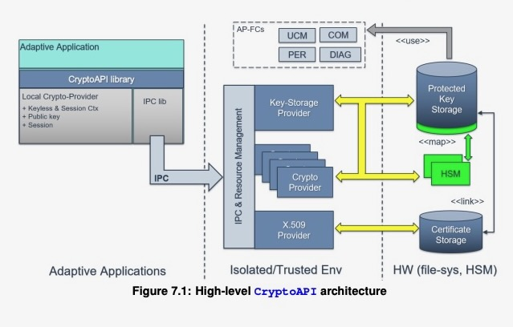

# Cryptography
- It provides a set of methods, which enable application and system developer
to store and transmit information while safeguarding it from intruders.
- It provides cryptographic methods to keep critical information in confidential and / or authentic form, and to communicate in a way such that only the intended recipient can read
the message.

## Cryptography is divided into
- Crypto provider
    - Mechanisms for building applications that ensure the following security goals
        - Authenticity 
        - Non repudiation
        - Confidentiality
        - Integrity
- Key storage provider
    - The purpose of this element is secure persistent storage of any supported cryptographic objects
      and programmatic access to them via a unified interface, independently from actual
      physical storage implementations. Guaranteeing correct access to the keys, CryptoAPI restricts access to this material.
- x509 certificate management
    - It allows to manage PKI certificates. Here, all typical certificate handling mechanism,
      such as issuing, revocation, and replacement, are handled. Additionally, certificate
      management API provides a kind of permanent storage where all certificates are
      stored. All operations on certificates are done by certificate management, which enforces access permissions by implementing the Policy Enforcement Point.

### Below diagram provides the overview of cryptography

- Application of crypto modules
    - Trusted application like Function clusters (Com, DM, PM etc)
    - Non Trusted application like Adaptive application

- Types of key slots
    - Application : 
        - The application has exclusive access to this key slot. It is able to import/export, update/delete and use the contained key-material. No other application 
        or Functional Cluster may access this Key Slot.
        - It is __exclusive__ to an application

    - Machine : 
        - This type of Key Slot is defined by the adaptive machine and may be
        used by the Functional Cluster for which it is configured. Additionally, the
        Key Slot may be assigned to a single Adaptive Application that is then
        able to manage the contained key-material.
        - It can be used by __any__ (Function cluster or adaptive application)

- IO Interface
    - It simplify interaction between domains
    - It abstract interfaces from the actual object the IOInterface interface has been introduced as an intermediate layer between the persistent resource and the runtime object. For example, it can be used by an application to instantiate
    a runtime crypto-object from its persistent storage location (read-access) like for KDF. Or it can be used by an application to store a runtime crypto-object into a persistent storage location (write-access) like MAC.

## Crypto API elements

### Hash / Digest
A hash-function is a one-way function and maps an arbitrary string of bits to a fixedlength string of bits. Due to its nature the bit string result is practical infeasible to
invert. 

### RNG
Generating randomness or pseudo randomness is required for many operations such
as creating Salts or Nonces. In order to enable applications to perform these operations, CryptoAPI provides an interface to generate random data. Randomness can be generated by True Random Number Generators (TRNGs) or by Cryptographically Secure Pseudo Random Number Generators (CSPRNGs).

The entropy is used to generate a deterministic but unpredictable stream of
random data. 

### KDF
- Derives a key from a base key, creating a new key object.

### Key Agreement

### MAC

### Symmetric block cipher

### Stream cipher

### Authenticated cipher

### Symmetric key wrap
- wraps (i.e., encrypts) a private or secret key.
- Key Wrapping encapsulates Key Material, which is used for example to store a key in an unsecure environment or transport a key by an unsecure channel. Wrapping a key is a kind of encryption of the key and contributes to confidentiality.
- Wrapping a key requires a KEK. With the call of the CryptoAPI interface the KEK is set (deployed) to the key wrapper algorithm context. Additionally, a ”direction” indicator is used to define the transformation direction, such as wrapping, unwrapping, signature calculation, or signature verification.

### Verifier public / Message Recovery public / Encryptor public

### Signer private / Signature Encode private / DecryptorPrivateCtx 
Digital signature contributes to goal authenticity when information is transferred. Guaranteeing the authenticity of the information asymmetric cryptography is used, where
the information is signed by a private key and verified later by using the matching public key. When the verification is successful, the receiver of the information can be sure that the owner of the private key is the sender of the information.

### Key Encapsulation public
A key encapsulation mechanism (KEM) works just like a public-key encryption
scheme, except that the encryption algorithm takes no input other than another key.
Therefore, the KEM uses randomly generated Key Material, the key encryption key
(KEK), to encapsulate an input, in this situation a key. The input is encapsulated with
an encryption with a target public key, 

### Key Decapsulation private

### Create signature

### Generate private key, generate seed and generate symmetric key

