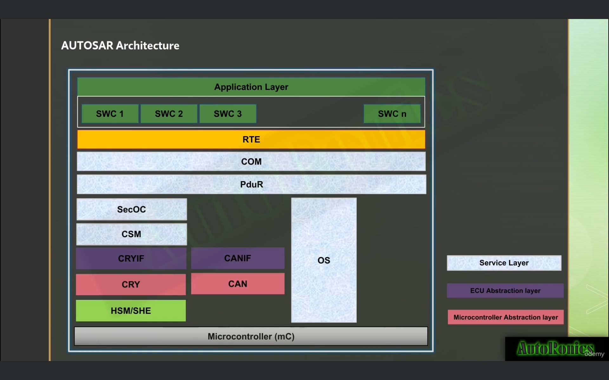
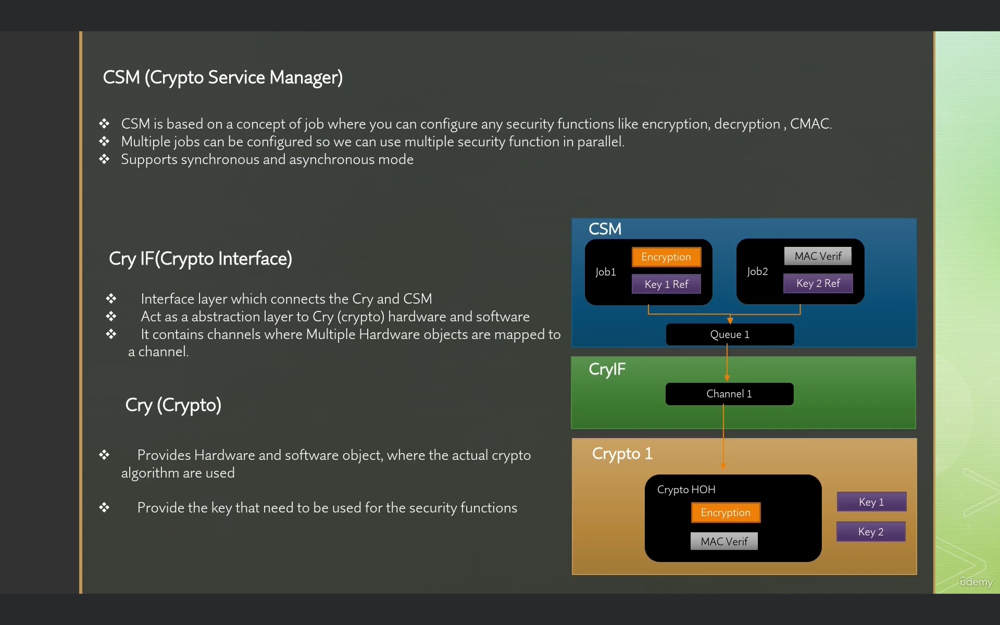
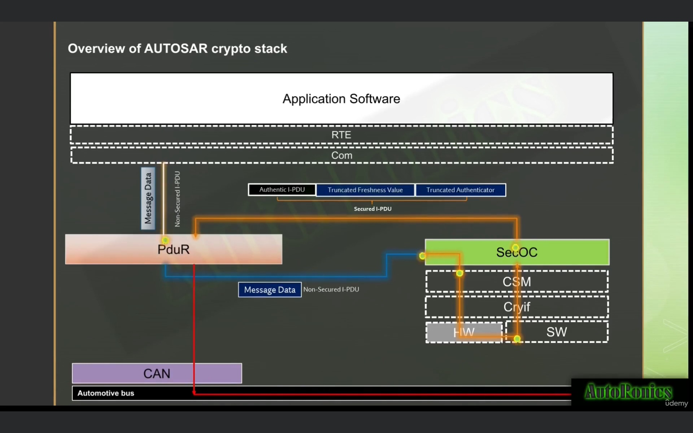
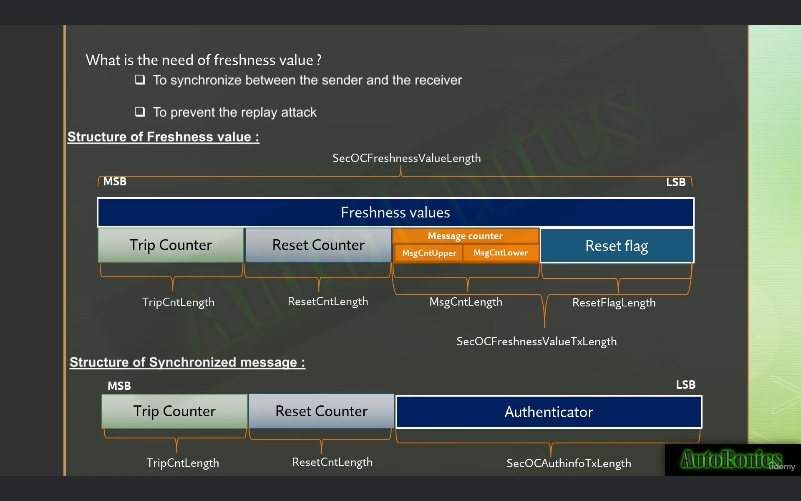
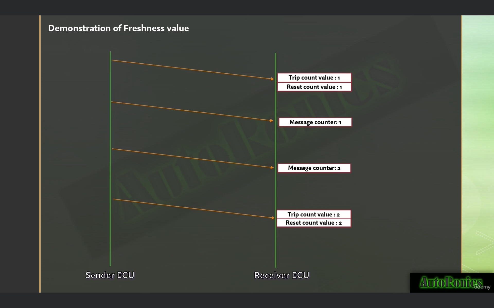
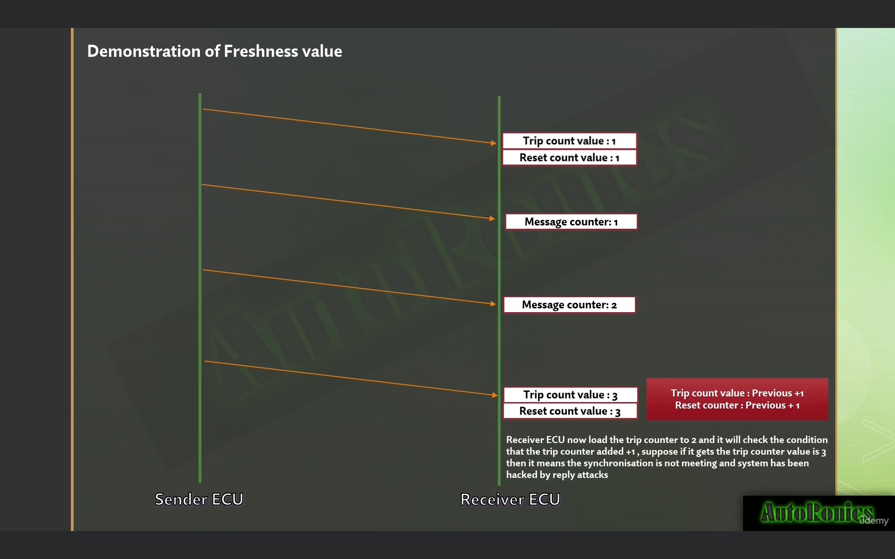
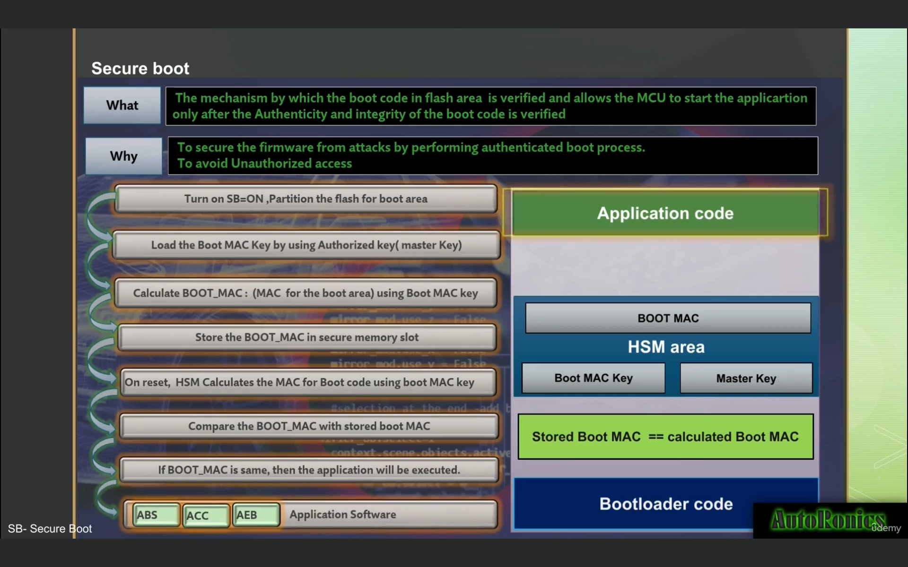
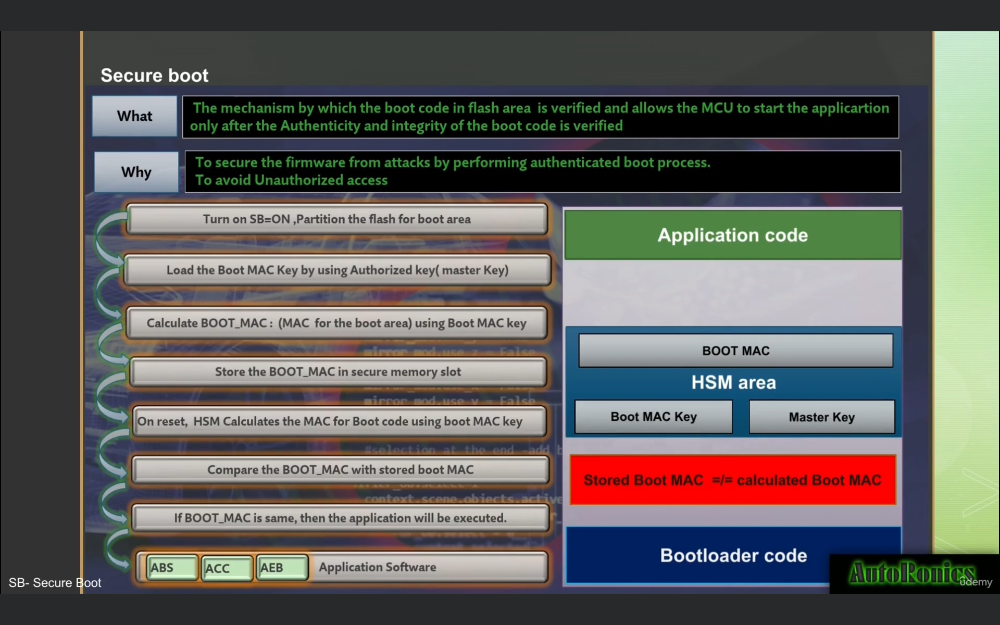
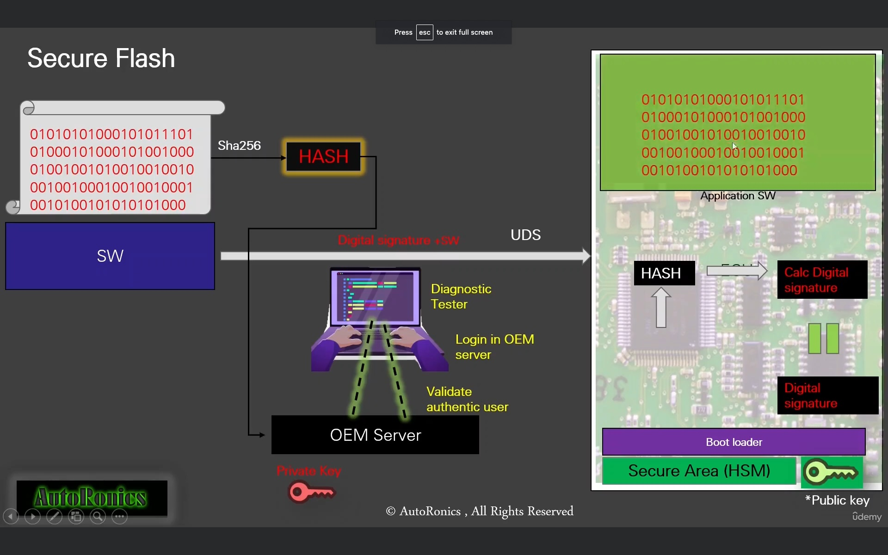

# Classic Autosar

## Crypto in Autosar stack

## Crypto layers description

## Secured onboard communication

### Securing PDU

### SecOC PDU freshness value

### SecOC PDU freshness value - use case true

### SecOC PDU freshness value - use case false

## Secure boot

### Secure boot positive

### Secure boot negative

### Secure flash
