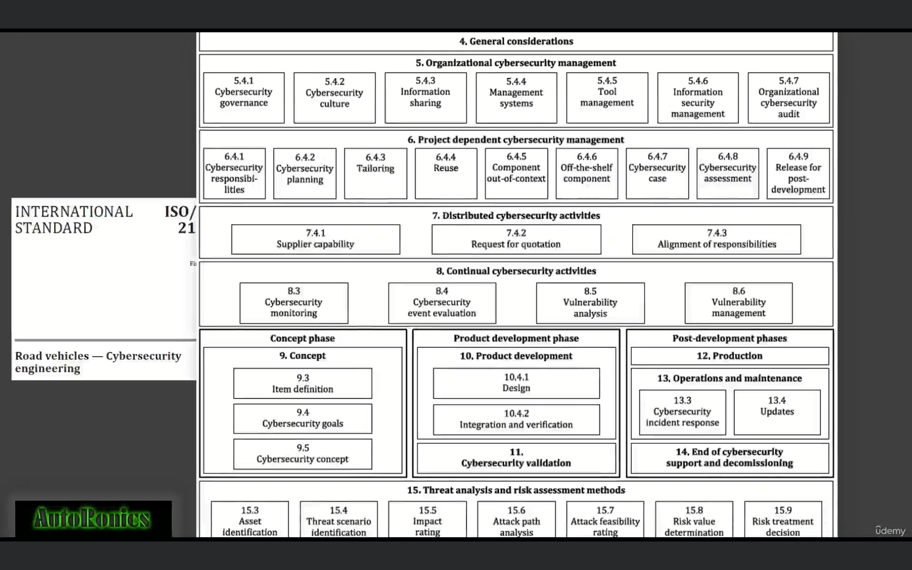
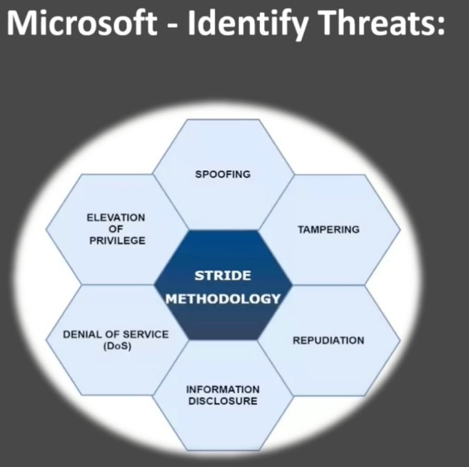
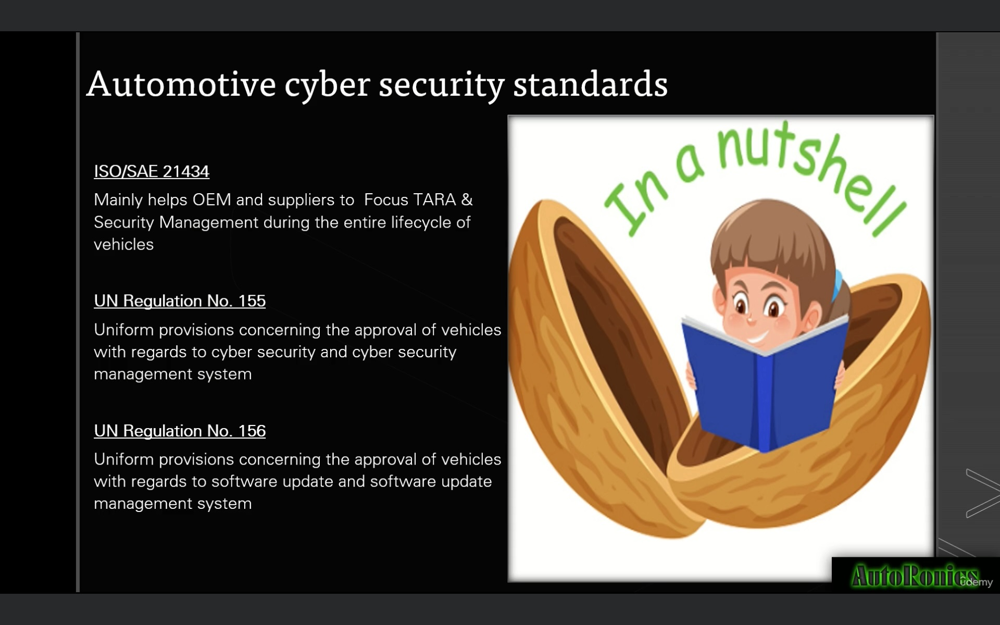

# Cryptography standards

## ISO 21434 : Road safety cybersecurity engineering

### Its chapters and overview

- Some important abbreviations
    - RQ : requirement and mandatory
    - RC : recommondation, but not mandatory
    - PM : Permission, as best practices
    - WP : Work packages as output

### TARA
- It is thread assesment and risk assessment
- It can be used find out the security goal
- TARA-Sample.xlsx can be seen for reference

## STRIDE
- It is an abbreviation to find out threats in microsoft

## UN specification for cryprography
### UN R155
- It has three parts in annex 5 
- Part A
    - It deals with the vulnerabilities
    - Threats regarding back-end servers related to vehicles in the field
    - Threats to vehicles regarding their communication channels
    - Threats to vehicles regarding their update procedures
    - Threats to vehicles regarding unintended human actions facilitating a cyber attack
    - Threats to vehicles regarding their external connectivity and connections
    - Threats to vehicle data/code
    - Potential vulnerabilities that could be exploited if not sufficiently protected or hardened
- Part B
    - It deals on how to mitigate threats intended for vehicles in part A vulnerabilities
    - Like USB, OBD port, communication channels
    - external connectivity and channels
- Part C
    - It deals on how to mitigate threats outside of vehicles in part A vulnerabilities
    - Like back-end-servers, unintentional load of malware
### UN R156
- It deals with the OTA

# Conclusion

