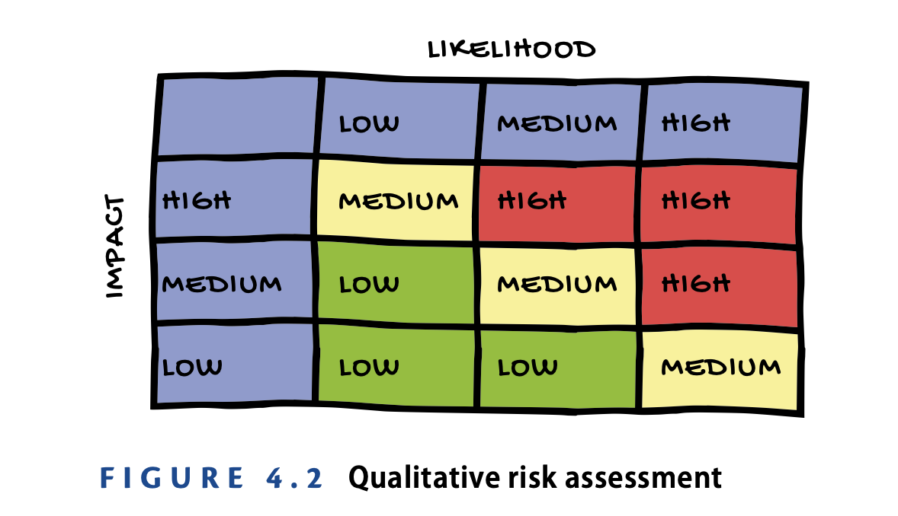
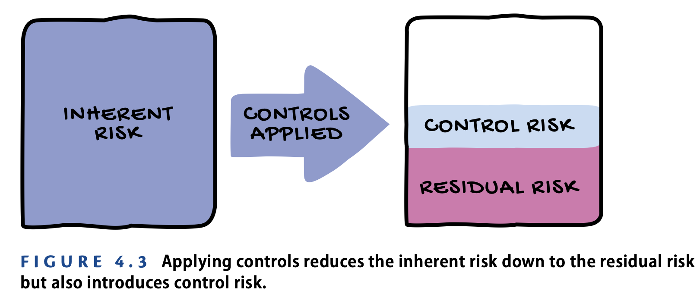

# CIA Triad

## Confidentiality

- Confidentiality ensures that only authorized individuals have access to information and resources.
- Threats
    - Snooping : The individual engaging in snooping wanders around your office or other facility and simply looks to see what information they can gather
    - Dumpster Diving : Dumpster diving attacks also look for sensitive materials, but the attacker doesn’t walk around the office; instead, they look through the trash
    - Eavesdropping/wiretapping : the attacker simply positions themselves where they can overhear conversations, such as in a cafeteria 
    - Social Engineering : ttacker uses psychological tricks to persuade an employee to give them sensitive information or access to internal systems. They might pretend that they’re on an urgent assignment from a senior leader
## Integrity
- This means that there aren’t any unauthorized changes to information. Unauthorized changes may come in the form of a hacker seeking to intentionally alter information or a service disruption accidentally affecting data stored in a system

- Threats
    - Unauthorized Modification of Information : The unauthorized modification of information occurs when an attacker gains access to a system and makes changes that vio- late a security policy
    - Impersonation : the attacker pretends to be someone other than who they actually are
    - Man-in-the-Middle Attacks : the attacker intercepts network traffic as a user is logging into a system and pretends to be that system. They then sit in the middle of the communi- cation, relaying information between the user and the system while they monitor every- thing that is occurring
    - Replay attack : the attacker doesn’t get in the middle of the com- munication but finds a way to observe a legitimate user logging into a system.

## Availability
- availability controls ensure that information and systems remain available to authorized users when needed.
- Threats
    - Denial-of-Service Attacks : when a malicious individual bombards a system with an overwhelming amount of network traffic
    - Power Outages : Power outages can occur on a local or regional level for many differ- ent reasons
    - Hardware Failures : ervers, hard drives, network gear, and other equipment all fail occasionally and can disrupt access to information
    - Destruction of Equipment : Sometimes equipment is just outright destroyed.
    - Service Outages : This might be due to programming errors, the failure of underlying equipment, or many other reasons

## NON-REPUDIATION
- Non-repudiation is a security goal that prevents someone from falsely denying that something is true
- For example, you might agree to pay someone $10,000 in exchange for a car. If you just had a handshake agreement, it might be possible for you to later repudiate your actions. You might claim that you never agreed to purchase the car or that you agreed to pay a lower price.
- a signed contract is used, to solve above problem
- Digital signatures use encryption technology to provide non-repudiation for electronic documents.
- You might use bio- metric security controls, such as a fingerprint or facial recognition, to prove that someone was in a facility or performed an action

# Authentication and Authorization
This is to ensure that only authorized individuals gain access to information, systems, and networks under your protection.

## Identification
- an individual makes a claim about their identity
- During the identification step of the process, you might walk up to the security desk and say, “Hi, I’m Vipul Sinha.”

## Authentication
- the individual proves their identity to the satisfaction of the access control system
- the guard would likely want to see my driver’s license to confirm my identity.

## Authorization
- The access control system also needs to be satisfied that you are allowed to access the system
- the security guard might check a list of that day’s appointments to see if it includes my name or you scan your ID card.

## Accounting
- accounting functionality that allows administrators to track user activity and reconstruct it from logs
- security guard may write down my access to the building in a visitor logbook or card access is logged into server.

## PASSWORD POLICIES
- Password Length
- Password Complexity
- Password Expiration
- Password History
- Password Resets
- Password Reuse
- Password Managers

## AUTHENTICATION FACTORS
- Something You Know : passwords, PIN
- Something You Are : Biometric, Eye scan
- Something You Have : physical possession of a device like ID card, smartphone, token, smart cards 

## Multi-factor Authentication
- combining something you know with something you have
- An approach that combines a password with the answer to a security question is not multi-factor authentication, because both factors are something you know.

# Privacy
From credit card transac- tions to educational records, each of us generates a significant trail of data, and we are rightfully concerned about the privacy of that information.

## Types of Private Information
- Personally identifiable information (PII) : It includes all information that can be tied back to a specific individual.
- Protected health information (PHI) : It includes health care records that are regu- lated under the Health Insurance Portability and Accountability Act (HIPAA).

## Expectation of Privacy
- laws that govern whether information must be protected 
- When you’re using a computer or network that belongs to your employer, you generally do not have a reasonable expectation of privacy.
- when you provide private information to a government agency through their website, such as completing your taxes or registering for a medical insurance program, you have a much greater expectation of privacy.

## PRIVACY MANAGEMENT FRAMEWORK
- Management : The entity defines, formally documents, communicates, and assigns accountability for its PI (personal information) privacy policies and procedures
- Agreement, Notice, and Communication : The entity makes formal agreements, notifies and communicates with and offers choices when seeking data subject consents, including reasons why and purposes for which the entity seeks to obtain and use a data subject’s PI.
- Collection and Creation : The entity collects and creates PI only for the purposes identified in its agreements with data subjects, and in ongoing communications with and notices provided to data subjects.
- Use, Retention, and Disposal : The entity limits the use of PI to the purposes identified in the formal agreements/notices, and for which a data subject has provided explicit (or implicit) consent. The entity retains PI for the time necessary to fulfill the stated purposes identified in the formal agreements/notices or as required by laws or regulations. Once those purposes have been met, the entity securely disposes of the information.
- Access : The entity provides data subjects with access to their PI when requested or when asked to update and correct data errors or make changes.
- Disclosure to Third Parties : The entity discloses PI to third parties only for the purposes identified in data subject pri- vacy agreements and its privacy notice and with the explicit consent of the data subject.
- Security for Privacy : The entity protects PI against unauthorized access, removal, alteration, destruction and disclosure (both physical and logical).
- Data Integrity and Quality : The entity maintains accurate, complete and relevant PI for the purposes iden- tified in the notice and protects the representational integrity of the PI in its ongoing inter- actions with data subjects.
- Monitoring and Enforcement : The entity monitors compliance with its privacy policies and procedures and has procedures to address privacy- related complaints and disputes.

# Risk Management

Risk management is the practice of identi- fying, assessing, and treating the risks facing an organization.

## RISK TYPES

- Internal Risk
- External Risk
- Multiparty Risk
- Legacy Systems risk
- Intellectual Property
- Software License Compliance

## RISK IDENTIFICATION AND ASSESSMENT

The process of identifying and triaging the risks facing an organization based on the likelihood of their occurrence and their expected impact on the organization.

- Threats : external forces that jeopardize the security of your information and systems.
- Vulnerabilities : weaknesses in your security controls that a threat might exploit to undermine the CIA triad of your information or systems
- Risks : when your environment contains both a vulnerability and a corresponding threat that might exploit that vulnerability
- Threat vector : the method that an attacker uses to get to a target. This might be a hacker toolkit, social engineering, or physical intrusion.

## Ranking Risks

- Risk Likelihood : Probability that risk will actually occur
- Risk Impact : risk is the amount of damage that will occur if the risk materializes
- Risk Assessment Techniques : 
    - Qualitative techniques : subjective judgments to assess risks, typically categorizing them as low, medium, or high on both the likelihood and impact scales.
    - Quantitative techniques : objective numeric ratings to assess the likelihood and impact of a risk
    

## RISK TREATMENT STRATEGIES
Process of systematically analyzing potential responses to each risk and implementing strategies to control those risks appropriately.

- Risk Avoidance : 
    - you change your organization’s business practices so that you are no longer in a position where that risk can affect your business
    - magine that you performed a risk assessment of the risk that flooding posed to your organization’s data center. If you chose to pursue a risk avoidance strategy for that risk, you might relocate your data center to a facility where there is no risk of flood damage.
- Risk Transference : 
    - attempts to shift the impact of a risk from your organization to another organization
    - In the flood risk example, you might transfer the financial risk of your data center flooding from your organization to an insurance company by purchasing flood insurance.
- Risk Mitigation :
    - Take an actions designed to reduce the likelihood and/or impact of a risk.
    - Install systems designed to divert water away from your facility.
- Risk Acceptance :
    - Risk acceptance should only take place as part of a thoughtful analysis that determines that the cost of performing another risk management action outweighs the benefit of controlling the risk.
    - In the flooding scenario, you might conclude that all of the other risk management options are too costly and decide to continue operations in your current facility as is and deal with the aftermath of a flood should it occur.

## RISK PROFILE AND TOLERANCE
- risk profile : Risk or combination of risks that affect an organization
- inherent risk : Risk that exists in an organization before any controls are put in place
- control risk : Controls themselves may introduce some new risk. For example, if you install a firewall as a risk management control, that may reduce your risk substantially, but it also adds a new risk that the firewall itself may fail. That new risk that results from adding controls 
- risk tolerance : Business leaders must decide how much risk they choose to accept. 

### Note
The goal of risk management is to make sure that the combination of the residual risk and the control risk is below the organization’s risk tolerance.

# Security Controls
The procedures and mechanisms that an organization puts in place to address security risks in some manner. This might include trying to reduce the likelihood of a risk materializing, minimize the impact of the risk if it does occur, or detect security issues that do occur

## defense in depth principle
Applying multiple overlapping controls to achieve the same objective.

## CATEGORIZING SECURITY CONTROLS

- Types
    - Preventive controls : to stop a security issue from occurring in the first place. Eg. Firewall
    - Detective controls : identify potential security breaches that require further investigation. Eg. IDS
    - Recovery controls : remediate security issues that have already occurred. Eg. If ransomware infects a system and wipes out critical information, restoring that information from backup

- Categories
    - Physical controls :
        - that impact the physical world
        - Locks, camera, security guard
    - Technical controls : 
        - use of technology to achieve security objectives. 
        - Firewalls, intrusion prevention systems, encryption, data loss prevention, and antivirus software
    - Administrative controls :
        - processes that you put in place to manage technology in a secure manner
        - user access reviews, log monitoring, background checks, and security awareness training.

# Ethics
Code of Ethics includes four canons
- Protect society, the common good, necessary public trust and confidence, and the infrastructure.
- Act honorably, honestly, justly, responsibly, and legally.
- Provide diligent and competent service to principals.
- Advance and protect the profession.

# Security Governance Processes
Security governance processes are an integral part of safeguarding an organization’s data and infrastructure. Policies, procedures, standards, and laws all play an important role in directing the actions of cybersecurity professionals and other team members.

## SECURITY POLICIES AND PROCEDURES
- Security Policies : (Mandatory)
    - These bedrock documents that provide the foundation for an organiza- tion’s information security program. 
    - For example, statements like “All sensitive information must be encrypted with AES- 256 encryption” or “Store all employee records in Room 225” are not good policy state- ments. What happens if the organization switches encryption technologies or moves its records room?
    - Instead, a policy might make statements like “Sensitive information must be encrypted both at rest and in transit using technology approved by the IT department” and “Employee records must be stored in a location approved by Human Resources.” Those statements are much more likely to stand the test of time.
- Security Standards : (Mandatory)
    - It prescribe the specific details of security controls that the organization must follow. 
    - Standards derive their authority from policy
    - For example like the company’s approved encryption protocols, record storage locations, configuration parameters, and other technical and operational details.
- Security Guidelines : (Advice)
    - To provide advice to the rest of the organization, including best practices for information security
    - that employees use encrypted wireless networks whenever they are available
- Security Procedures : (Mandatory)
    - step-by-step instructions that employees must follow when performing a specific security task
    - For example, the organization might have a procedure for activating the incident response team that involves sending an urgent SMS alert to team members

## LAWS AND REGULATIONS
- Security professionals must be aware of all the laws and regulations that apply to them across the jurisdictions where their organizations operate. These may include national, state, and local laws. 
- The European Union’s General Data Pro- tection Regulation (GDPR) applies to the personal information of EU residents.
- Some industries are also governed by self-regulatory frameworks. The most common example of these is the Payment Card Industry Data Security Standard (PCI DSS), which regulates the storage, processing, and transmission of credit and debit card information.
