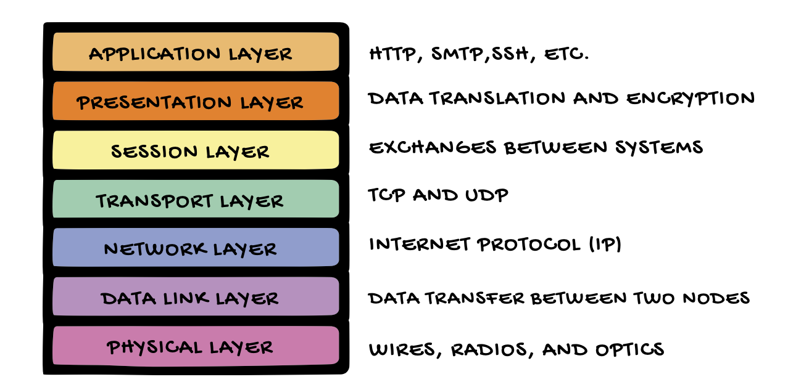
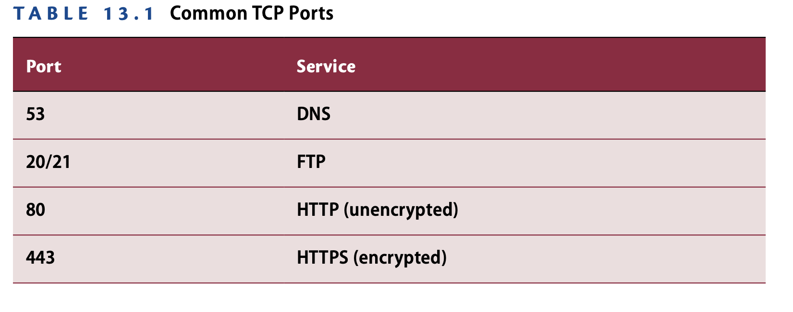
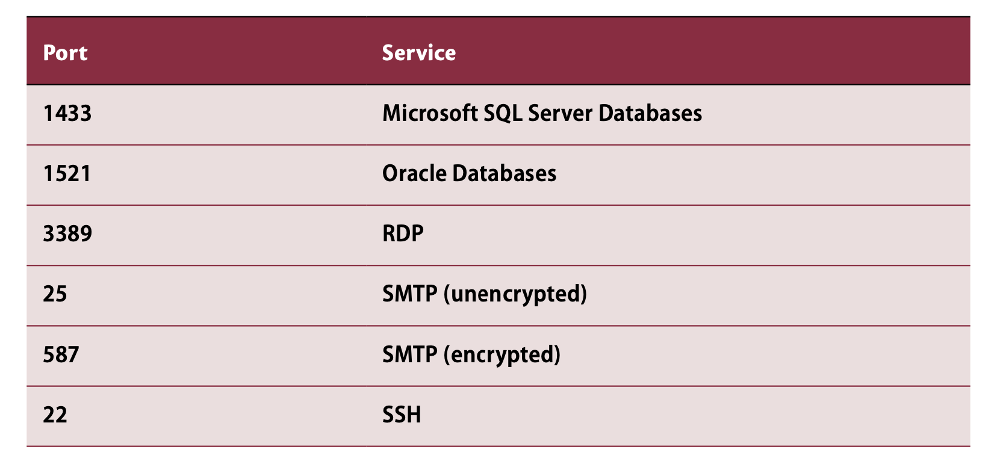
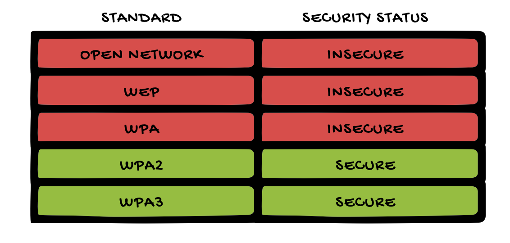
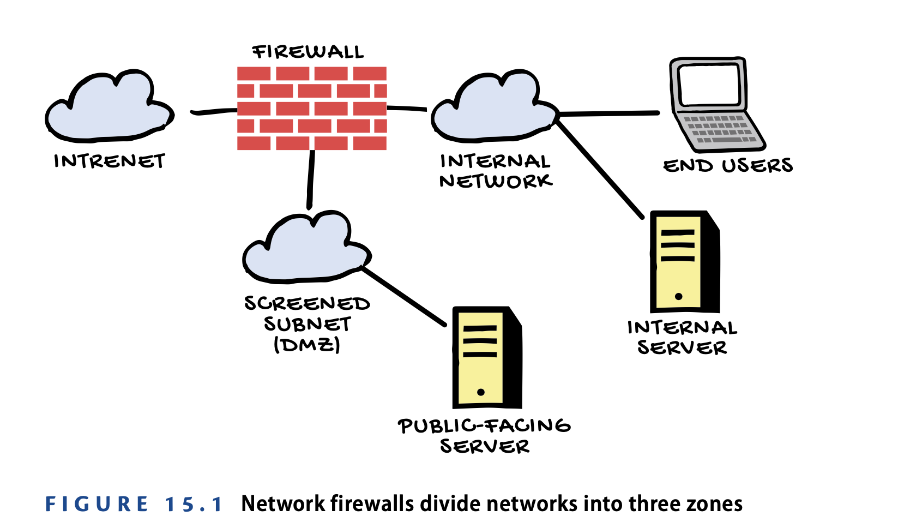

# Computer Networking

## NETWORK TYPES
- local area networks (LANs) : networks in homes and offices
- wide area networks (WANs) : WANs connect offices in different locations and also connect users to the Internet. Eg Wifi
- personal area networks (PANs) : They’re usually created by a computer or smartphone, and they’re designed to support a single person. For eg. Bluetooth
- Near-field communication (NFC) : It allows extremely short-range wireless con- nections. Eg. wireless payments and building access control systems.

## TCP/IP NETWORKING
- Internet Protocol : 
    - IP is responsible for routing information over the network. 
    - Even though it is referred to as the Internet Protocol, IP is used both on the Internet and on a LAN.
    - Each packet is a few kilobytes of data.
- Transmission Control Protocol :
    - responsible for setting up and tearing down connections between source and destination systems
- User Datagram Protocol : 
    - It has less overhead but does not guarantee the delivery of packets from one system to another.
    -  UDP lacks the reliability of TCP, but it operates much faster than TCP
- Internet Control Message Protocol :
    - is the housekeeping protocol of the Internet.

## OSI Model
    

## IP ADDRESSING
- servers are configured with static IP addresses, and end-user devices are configured with dynamically changing IP addresses.
- IP addresses can be assigned in two ways:
    - Static IP 
    - DHCP
- No octet in an IP address should ever be larger than 255
- IP addresses starting with the number 127 are reserved for use as loopback addresses
- The first number in an IP address should never be higher than 223.
- 224 and 239 are called multicast addresses
- 240 and 255 are reserved for experi- mental use

## Domain Name System
- The Domain Name System (DNS) allows people to use easily recognizable names in place of IP addresses.

## NETWORK PORTS AND APPLICATIONS
- Ports between 0 and 1,023 are called well-known ports
    - web servers use the well-known port 80
    - secure web servers use port 443 
- Ports between 1,024 and 49,151 are known as registered ports. 
    - For example, Micro- soft reserved port 1433 for SQL Server database connections, while Oracle registered port 1521 for its own database’s use.
- Ports above 49,151 are set aside as dynamic ports

## SECURING WI-FI NETWORKS
- Disable SSID Broadcasting
- Change Default Passwords
- Authenticate Wi-Fi Users
    - Preshared Keys
    - Enterprise Authentication
    - Captive Portals like hotels, airports, coffee shops, and other public locations.

## Wireless Encryption
- Wired Equivalent Privacy (WEP)
- Wi-Fi Protected Access (WPA) : encryption key for each packet
- Wi-Fi Protected Access 2 (WPA2) : uses an encryption protocol (AES)
- Wi-Fi Protected Access 3 (WPA3) : Uses Simultaneous Authentication of Equals (SAE)

# Network Threats and Attacks

## MALWARE
Malware objects infect computer systems and then perform some type of evil action: possibly stealing information, damaging data, or otherwise disrupting normal use of the system.

- Viruses : 
    - The defining characteristic of a virus is that it spreads from system to system based on some type of user action. This might be opening an email attachment, clicking a link to a malicious website, or inserting an infected USB drive into a system.
    - The best ways to protect against viruses is through user education.
- Worms : 
    - Worms spread from system to system without user interaction. They spread under their own power. 
    - The best way to defend against worms is keeping systems updated with the most recent operating system and applica- tion patches.
- Trojan Horses : 
    - They pretend to be legiti- mate pieces of software that a user might want to download and install. When the user runs the program, it does perform as expected; however, the Trojan horse also carries a malicious hidden payload that performs some unwanted action behind the scenes
    - application control provides a good defense against this threat.

## EAVESDROPPING ATTACKS
an attacker can gain physical or logical access to the network and eaves- drop on communications between two systems.

- On-Path Attacks : 
    - man-in-the- middle (MitM) and man-in-the-browser (MitB) attacks.
    - DNS or ARP poisoning.
    - Encryption, such as that used with HTTPS, prevents any of those intermediate devices from viewing or altering the communication.

## DENIAL-OF-SERVICE ATTACKS
- A DoS attack, as shown in Figure 14.4, is an attack that makes a system or resource unavailable to legitimate users. It sends thousands or millions of requests to a network, server, or application, overwhelming it and making it unable to answer any requests. 
- This compormises the availability leg of the CIA triad
- distributed denial-of-service (DDoS) 

## SIDE-CHANNEL ATTACKS
Computer systems generate characteristic footprints of activity, such as changes in pro- cessor utilization, power consumption, or electromagnetic radiation. Side-channel attacks seek to use this information to monitor system activity and retrieve information that is actively being used.

# Threat Identification and Prevention
Understanding and mitigating network threats is critical in safeguarding data and systems. Intrusion detection systems, intrusion prevention systems, firewalls, and antivirus software play pivotal roles in identifying and neu- tralizing potential attacks.

## ANTIVIRUS SOFTWARE
- Antivirus software uses two different mechanisms to protect
    - Signature detection uses databases of known malware patterns 
    - Behavior detection detects discover abmormal anomalies—activity that deviates from that normal pattern and report it.
## INTRUSION DETECTION AND PREVENTION
- Intrusion Detection :
    - Intrusion detection systems sit on the network and monitor traffic, searching for signs of potentially malicious traffic
    - web server contains a SQL injection attack
    - user’s login attempt seems unusual
    - internal network is attempting to contact a botnet and control server
- Intrusion Prevention :
    - Intrusion prevention systems are
    just like intrusion detection systems but with a twist: They can take immediate corrective action in response to a detected threat. 
- Environments Monitored :
    - Host-based IDS (HIDS) and host-based IPS (HIPS) systems monitor and protect individual devices like computers and servers
    - Network-based IDS (NIDS) and network-based IPS (NIPS) systems focus on safe- guarding the entire network.
- Classification Errors :
    - False positive errors occur when the system alerts administrators to an attack but the attack does not actually exist. 
    - False negative errors occur when an attack actually takes place but the IDS does not notice it.

## FIREWALLS
- Network firewalls serve as the security guards of a network
- One interface connects to the Internet or another untrusted network.
- A second interface connects to the organization’s intranet.
- The third interface connects to the screened subnet. Also known as the DMZ, the screened subnet is a network where you can place systems that must accept connections from the outside world, such as a mail or web server. 

## VULNERABILITY SCANNING
vulnerability scanning to detect new vulnerabilities as they arise and then implement a remediation workflow that addresses the highest-priority vulnerabilities. 
- Network Vulnerability Scanning
They reach out to any systems connected to the network,attempt to determine the type of device and its configuration, and then launch targeted tests designed to detect the presence of any known vulnerabilities on those devices.
    - Tenable’s Nessus
    - Qualys’s vulnerability scanner (SaaS)
    - open source OpenVAS
- Application Scanning
    - Static testing analyzes
    - Dynamic testing
    - Interactive testing combines static and dynamic testing, analyzing the source code while testers interact with the application through exposed interfaces.
- Web Application Scanning
These tools are specialized tools used to examine the security of web applications.
    - SQL injection, 
    - cross- site scripting (XSS), 
    - cross-site request forgery (CSRF) 

# Network Security Infrastructure

## DATA CENTER PROTECTION
- Air Temperature
- Humidity
- Fire
- Power

# SWITCHES, WAPs, AND ROUTERS
## Switches
- Network engineers use switches to connect devices to networks. 
## WAPs
- Many devices don’t use wires but instead depend on radio-based wireless networks. These networks are created by wireless access points (WAPs)
## Routers
- Routers play a higher-level role, connecting networks together by serving as a central aggregation point for network traffic heading to or from a large network.
- Routers also perform some security functions, using access control lists (ACLs) to limit the traffic that can enter or leave a network based on the organization’s security policies.

## NETWORK SEGMENTATION
- Virtual LANs (VLANs) are an important network security control. VLANs are used to create network segmentation.
- Microsegmentation is an extreme segmentation strategy that uses very small network segments that can be modified often to meet changing business requirements. These net- work segments can be created temporarily to allow two systems to communicate and then removed when they are no longer needed.

## VIRTUAL PRIVATE NETWORKS
- Site-to-site VPNs allow the secure interconnection of remote networks, such as connecting branch offices to corporate headquarters or each other.
- Remote access VPNs provide mobile workers with a mechanism to securely con- nect from remote locations back to the organization’s network.

## NETWORK ACCESS CONTROL
NAC technology intercepts network traffic from devices that connect to a wired or wireless network and verifies that the system and user are authorized to connect to the network before allowing them to communicate with other systems.

- The first is the device that wants to connect to the NAC-protected network. This device must be running a special piece of software called a supplicant. The supplicant is responsible for performing all of the NAC-related tasks on behalf of the user and system.
- The second device involved in the authentication is the switch that the device connects to, in the case of a wired network. This device, which receives cre- dentials from the end user, is known as the authenticator in NAC terms. On a wireless network, the wireless controller serves as the authenticator.
- The third device is the backend authentication server. This is a centralized server that performs authentication for all of the authenticators on the net- work. In fact, it often performs authentication for many different services. NAC authentication is just one of those supported services.

## Role-Based Access Control
- In role-based access control, once the authenticator verifies the identity of the user through the authentication server, it also makes a decision about where to place the user on the network based on that user’s identity.

## Posture Checking
- Network access control can also perform posture checking, also known as endpoint compli- ance checking. Networks using this technology verify that devices connecting to the net- work comply with the organization’s security policy before granting broader access.

# Cloud Computing
Cloud computing is the delivery of computing services to users over a network

## CLOUD DEPLOYMENT MODELS
- Private Cloud :
In the private cloud approach, the organization builds and runs its own cloud infrastructure or pays another organization to do so on its behalf.
- Public Cloud :
cloud providers build massive infrastructures in their data centers and then make those resources available to all comers. The same physical hardware may be running workloads for many different customers at the same time.
- Hybrid Cloud :
In this model, they can use the public cloud for some computing work- loads, but they also operate their own private cloud for some workloads, often because of data sensitivity concerns.
- Community Cloud :
Community clouds are similar to private clouds in that they are not open to the general public, but they are shared among several or many organizations that are related to each other in a common community. For example, a group of colleges and universities might get together and cre- ate a community cloud that provides shared computing resources for faculty and students at all participating schools.

## CLOUD SERVICE CATEGORIES
- Software as a Service (SaaS) :
    - the public cloud provider delivers an entire appli- cation to its customers. Customers don’t need to worry about processing, storage, net- working, or any of the infrastructure details of the cloud service. 
    - the vendor manages almost everything, and the only responsibility that the customer has is knowing what data is stored in the service and applying appropriate access controls.
- Platform as a Service (PaaS) :
    - vendors provide customers with a platform where they can run their own application code without worry- ing about server configuration
    - the customer is still responsible for the data and applica- tions but doesn’t directly interact with the operating system, so that responsi- bility shifts to the vendor.
- Infrastructure as a Service (IaaS) : 
    - vendors purchase basic computing resources from vendors and piece them together to create customized IT solutions. For example, IaaS vendors might provide compute capacity, data storage, and other basic infrastruc- ture building blocks. The three major vendors in the IaaS space are Amazon Web Services, Microsoft Azure, and Google Cloud Platform.
    - the vendor is responsible for managing the security of their hardware and data center
    - Customers configure the operating system, applications, and data, so securing those elements is primarily a customer responsibility.