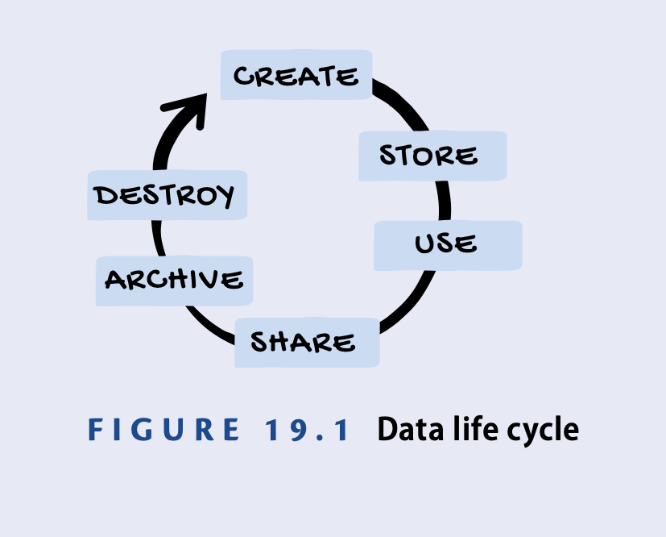

# Encryption

- Encryption is the process of transforming plaintext information into ciphertext that can’t be read by unauthorized individuals. Decryption uses a decryption key to convert ciphertext back into plain text.
- Encryption can be used to protect data at rest by encrypting individual files or folders. Full‐disk encryption (FDE) uses encryption to protect the entire contents of a device.
- Encryption can be used to protect data in transit by encrypting it as it travels over a network. The HTTPS protocol encrypts web traffic and is a secure alternative to the unencrypted HTTP protocol. Virtual private networks (VPNs) encrypt entire network connections.
- Symmetric encryption algorithms, such as AES, use the same key to encrypt and decrypt messages. Asymmetric encryption algorithms, such as RSA, use public and private key pairs.
- Hash functions are one‐way functions that transform a variable‐length input into a unique, fixed‐length output.

# Data Handling
It covers everything from the time data
is first created until the time it is eventually destroyed.

# DATA CLASSIFICATION
## Classification Schemes
- For example, the military uses the following classification scheme to safeguard government data:
▶ Top Secret
▶ Secret
▶ Confidential
▶ Unclassified

- A business, however, might use friendlier terms to accomplish the same goal, such as:
▶ Highly Sensitive
▶ Sensitive
▶ Internal
▶ Public

## Labeling
- Using standard labeling practices ensures that users are able to consistently recognize sensitive information and handle it appropriately.

# Logging and Monitoring

## LOGGING
- Logs provide a treasure trove of information for security professionals, whether they’re investigating an incident, troubleshooting a technical problem, or gathering evidence.
- Three main objectives
    - Accountibility: They can determine who caused the event. 
    - traceability
    - auditability : They can provide clear documentation of those actions.

## LOG MONITORING
Security information and event management (SIEM) systems have the following two major functions on an enterprise network:
    - They act as a central, secure collection point for log entries.
    - They apply artificial intelligence. This correlates all of those log entries to detect patterns of potentially malicious activity.

# Configuration Management
Configuration management establishes and monitors the way that specific devices are set up. Configuration management tracks both operating system settings and the inventory of software installed on a device.
- Baselines : snapshot of a system or application at a given point in time. 
- Version Control : Versioning assigns each release of a piece of software an incrementing version number that can be used to identify any given copy.

## CONFIGURATION VULNERABILITIES
- Default Configurations : 
One common mistake that IT staff often make is taking a system directly from a manufac- turer and installing it on their network without modifying the default configuration.
- Weak Security Settings : Systems that are misconfigured or configured with weak security settings can be serious problems.
- Cryptographic Weaknesses : configures weak cipher suites or weak protocol implementations on a device, or If a private key becomes known to a third party,

## Patch and Update Management
- Patch management ensures that systems and applications receive all of the security updates provided by manufacturers to correct known vulnerabilities. 

## Account Management
If an account is improperly configured with excess permissions, the user owning that account can use those extra privileges to cause damage.

# Best Practice Security Policies

## ACCEPTABLE USE POLICY (AUP)
AUPs often address whether personal use of com- puters and systems is permitted and how much personal use is considered acceptable.

## DATA HANDLING POLICY
Data handling policies describe the security controls and procedures that must be used to protect sensitive information. 

## PASSWORD POLICY
Password policies cover the protection and use of passwords in the organization

## BRING YOUR OWN DEVICE POLICY (BOYD)
Many organizations now allow employees to use their own smartphones, tablets, and com- puters to access company information. Organizations that allow this type of work should create a bring your own device (BYOD) policy that documents the requirements for using personal devices, the security controls that must be in place, and the types of information that can be processed.

## PRIVACY POLICY
Privacy policies are an important way to communicate with employees, customers, and other individuals about what information the organization retains about them and the ways that they will store, process, transmit, and maintain that information.

## CHANGE MANAGEMENT POLICY
The change management policy should include the procedures that the team should follow for the documentation, approval, and implementa- tion of any technology changes that will occur.
should also include the development of rollback plans

# Security Awareness Training
Security awareness training is a crucial part of any cybersecurity strategy. It’s an ongoing process that equips people to recognize and respond to threats, including social engineering, which manipulates individuals into divulging sensitive information.

## SOCIAL ENGINEERING
Social engineering attacks use psychological tricks to manipulate people into performing an action or divulging sensitive information that undermines the organization’s security. 

Social engineering attacks are successful for the following reasons:
- Authority and trust
- Intimidation
- Consensus and social proof
- Scarcity
- Urgency
- Familiarity and liking

## SECURITY EDUCATION

- Security training provides users with the detailed information they need to pro- tect the organization’s security. These may use a variety of delivery techniques, but the bottom line goal is to impart knowledge. Security training takes time and attention from students.
- Security awareness is meant to remind employees about the security lessons they’ve already learned. 